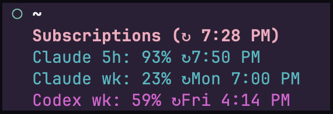

# Subscription watcher for Herdr

Shows your remaining Claude Code and Codex allowance in the Herdr sidebar.
Refreshes hourly and matches your active theme.



`↻` marks the reset time in your local timezone.

## Install

Requires macOS, Herdr 0.9.2 or later, and Python 3.9 or later.
Log in to Claude Code and Codex before installing.

1. Clone the repository, or extract the [v0.1.0 ZIP](https://gitlab.com/purrly-digital-llc/herdr-stuff/subscription-watcher/-/archive/v0.1.0/subscription-watcher-v0.1.0.zip).

	```sh
	git clone https://gitlab.com/purrly-digital-llc/herdr-stuff/subscription-watcher.git
	cd subscription-watcher
	```

2. From the plugin directory, link it to Herdr. Keep that directory in place.

	```sh
	herdr plugin link "$PWD"
	```

3. Merge [sidebar.example.toml](sidebar.example.toml) into `~/.config/herdr/config.toml`.
	Update an existing `[ui.sidebar.spaces]` section rather than adding a duplicate.
	If rows are clipped, set `sidebar_min_width = 28` under `[ui]`.

	```sh
	herdr server reload-config
	```

4. Start the hourly job. If you are reinstalling, unload the existing job first
	with `launchctl bootout "gui/$(id -u)/io.herdr.subscription-usage"`.

	```sh
	/usr/bin/python3 make_launchagent.py
	launchctl bootstrap "gui/$(id -u)" "$HOME/Library/LaunchAgents/io.herdr.subscription-usage.plist"
	```

## Usage

Refresh now.

```sh
herdr plugin action invoke local.subscription-usage.refresh
```

Show cached usage from the plugin directory.

```sh
/usr/bin/python3 usage.py --print
```

Check the hourly job. `not running` is normal between runs.

```sh
launchctl print "gui/$(id -u)/io.herdr.subscription-usage"
```

If a row says `sign in again`, log in to that provider again and refresh.
`refresh due` means the reset time has passed. `refresh pending` means the cache
is missing or at least two hours old.

## Privacy

The plugin does not store or log credentials. Other Herdr session viewers can
see your usage and reset times. See the [security review](SECURITY.md) for details.

## Remove

```sh
launchctl bootout "gui/$(id -u)/io.herdr.subscription-usage"
rm "$HOME/Library/LaunchAgents/io.herdr.subscription-usage.plist"
herdr plugin unlink local.subscription-usage
```

Remove the subscription rows from `~/.config/herdr/config.toml` and run
`herdr server reload-config`. To delete cached usage, remove
`~/.local/state/herdr/subscription-usage/`.

## Test and package

Run these commands from the plugin directory.

```sh
/usr/bin/python3 -m unittest -v
/usr/bin/python3 build_release.py
```

The build reads the version from `herdr-plugin.toml` and writes a ZIP and
SHA-256 checksum to `dist/`. For version `0.1.0`, verify the checksum with this command.

```sh
(cd dist && shasum -a 256 -c subscription-watcher-0.1.0.zip.sha256)
```

Attach the ZIP and checksum to a GitLab Release. The checksum applies to this
package, not GitLab's source archive.

## License

[MIT](LICENSE)
